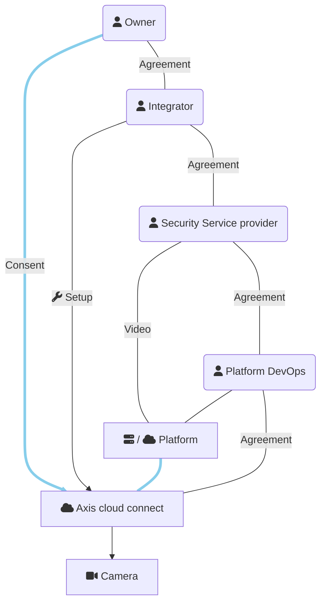

This is a minimal app showing how to handle consent on an Axis Cloud Connect
organisation when different parties are involved. It is the 'Platform' in the
drawing below, initially abbreviated to P, hence the name.

Scope of this code
==================
This example demonstrates keeping track of consent. It is:

- Not an official demo from Axis Communications
- Not production ready
- Not self-contained

It depends on modules not shared with this code. Still, those modules
are non-essential for the core concept around OAuth2.

Roles
=====

| Role | Description |
| ---- | ----------- |
| Service Provider | Operates a service that requires device access, for example: live observation of cameras or automated collection of counting data. The Service Provider typically uses a software for this, which in this overview is called 'Platform' |
| Platform | The software that performs the actual interaction with cloud connected cameras. Can be a cloud application itself or an on-prem installation at the Service Provider |
| Platform DevOps | In case of a cloud Platform, the party that takes care of running it. Included in this list because we can assume admins from this party have access to the tokens stored in the Platform. |
| System Integrator | A party that installs devices and configures software system on behalf of the Enduser/Owner |
| Enduser/Owner | Owns the devices and provides consent on the Cloud Connect platform for use of the cameras by others |

This drawing shows the relations:

In real life parties can take up more than one role at the same time,
simplifying the diagram.

Short description of the flow
=============================
- Enduser and System Integrator agree on realisation of a certain service
- Enduser and/or System Integrator agree with Service Provider to actually
  provide the service
- Enduser invites System Integrator on the relevant Axis Cloud Connect
  organisations so that System Integrator can act on behalf of Enduser and has
  access to the Enduser organisation on mysystems.axis.com
- System integrator sets up the system, coordinating where necessary with Platform DevOps
  and Service Provider
- Service Provider commences delivery of the service, which is not possible
  due to lack of consent by Enduser
- Platform sends consent request by e-mail to Enduser
- Enduser provides consent by following link that lead to authentication
  process on Axis.com. Enduser selects the agreed organisation
- Service Provider can continue. He can use the devices inside the Platform
  but has _no_ access through mysystems.axis.com.

In reality, flows can deviate a bit. For example, when Integrator stays
involved he is likely to to provide consent on behalf of the Enduser.

An introduction to OAuth
========================
Most of us are familiar with Google, Facebook and many others being able to
act as "identity provider" (abbreviation: IDP).  Many websites use this to
simply account management. That's convenient both for the website itself:
less account support, as well as for the user: less credentials to manage. You
will recognise this as the 'Login with Google' (or other providers) option on
websites and in apps.

The technology for this is called OAuth, now at version 2.0. However, OAuth is an
authorization delegation framework. It's not an authentication mechanism, although it's often used as
a foundation for it. The primary use cases it was designed to address are:

1. Delegated API access

   This is the core usecase. A user grants a third-party application limited access
   to their resources on another service, without sharing their credentials. 
   Classic example: a photo-printing app accessing your Google Photos on your behalf.

3. Login / Single Sign On

   Strictly speaking, this is OpenID Connect (OIDC) — an identity layer built on top
   of OAuth 2.0. OAuth alone doesn't define a standard way to convey user identity.
   
4. Machine-to-Machine (M2M) authorization

   Services authenticating and authorizing against each other with no user involved.
   Common in microservice architectures and IoT — e.g., a device autonomously calling a cloud API.
   
4. Consent & Scoped access to resources

   A resource owner (say, the owner of a Google mailbox or an Axis device) can grant revocable
   permissions to another party to use or manage those resources. Scopes define what access
   is granted, and tokens can be time-limited. This is central to IoT, smart-home ecosystems and also Axis Cloud Connect.
   
6. Limited/Constrained device authorization

   The Device Authorization Grant (RFC 8628) covers devices with limited input capability (smart TVs, IoT sensors).
   The device displays a code, and the user authorizes on a separate device with a full browser.

Back to website example we started with. In OAuth terminology, such entitities are called
'client' or 'app'. A website that will help you print your photos will need to act as OAuth client.
The client needs access to the resource (your photos on Google Photos) and for that it needs to request that access. As 
owner of the resource you'll typically get a screen presented that lists the permissions 
the client needs. This is called the consent screen. In the example of Google Photos, when logging 
in to the photo-print website using your Google account, you'll get a consent screen from Google that will show you this client wants to access your photos.

If you trust the website with that, you'll select yes. Other providers may allow you to more specifically 
chose what the client can and can not do.

OAuth and Axis Cloud Connect
----------------------------
Axis Cloud Connect uses OAuth 2.0 technology. The purpose is obviously not simplified
account management but to provide consent on access to resources. So, where the 
photo website example above still combined authentication and consent in one go, 
this is not the case with Axis Cloud Connect.

How it works is that an application (here: P) registers as client with Axis 
Cloud Connect. This is a one-time effort. It obtains a client ID and some secret value. For P to get access
to devices, it assembles a unique url that needs to be passed to the owner of
the devices. This is done by e-mail in this demonstrator. The e-mail address is known from the business agreement between the device owner and service provider that will use P. Upon receiving, the owner follows
the url to P's portal or axis.com directly and provides consent on P accessing devices in a specific
'organisation'. A notification of this consent is sent by axis.com to P on a
callback URL that was provided during registration.  The details inside that
notification (refresh token) are stored by P so that it can access devices at a later time. The person working at the service provider logging in to P need not have any relation with Axis.

To keep this all safe and secure, OAuth2 has some details which make the actual
mechanics a bit hard to grasp initially.  But the overall process and purpose
is as simple as explained above.

Acting on behalf of the enduser
-------------------------------
In professional video security, it is often the case that an Installer or
System Integrator (SI) takes care of system setup on behalf of an enduser.
When the software platform - P - is about to get involved, it is actually this
SI that grants access to P. For this to work, the owner must invite the SI as
administrator in his Axis Cloud Connect 'organisation'. This is done in the
'My systems' portal. From then on, the SI is able to consent to the use of
others using the devices, using _his_ MyAxis account and not the account of the
owner.

Implementation notes
====================
This module is built using Python and the [Django](https://www.djangoproject.com/) web framework.
It expects presence of other modules that in turn assume the presence of
[django-allauth](https://docs.allauth.org/en/latest/). django-allauth strongly
couples OAuth2 with authentication and is less suitable to obtain
consent from 3rd party individuals. This module therefore also uses
[Authlib](https://docs.authlib.org/en/latest/) but initialises Authlib using
the OAuth-client details provided by the configured client in django-allauth.                                    

This aspect is not crucial and can be ignored. A convenient side effect is
that one need not setup a local enduser account on the demo instance. One can login
using Axis as identity provider. The device access that comes with this login
(one needs to provide consent on an organisation) is ignored by the system.

Multiple Service Providers
--------------------------
This demo assumes a single Service Provider.  Multiple Service providers would
be supported by multi-tenancy: Each service provider gets it's own domain name
and database and possibly independently running instance. The web framework on
which this demo runs supports that, however new tenants can not be managed
from inside the demo.

Code layout
-----------
File structure mostly follows Django conventions. A short overview of the most
relevant files in this repository.

| Path | Description |
|------|-------------|
| urls.py | Binds urls to views (=functions handling a url) |
| models.py | Defines the database models |
| views.py | Defines the logic behind each url |
| oauth.py | authlib-based OAuth helper functions & allauh->authlib glue logic |
| serviceclient.py | Classes to interact with Axis Cloud Connect |
| admin.py | Glue logic for use in Django admin pages |
| management/commands | Maintenance commands to run from commandline |
| templates/P | Templates to render HTML pages for use in the views |
| js/my_services_overview.js | Client-side code for list of services for Enduser |
| js/service_page.js | Client-side code for a single service: devicelist and video |
| js/services_overview.js | Client-side code for list of services for Service Provider |
| js/webrtc.js | Client-side helper class to run webrtc negotation |

