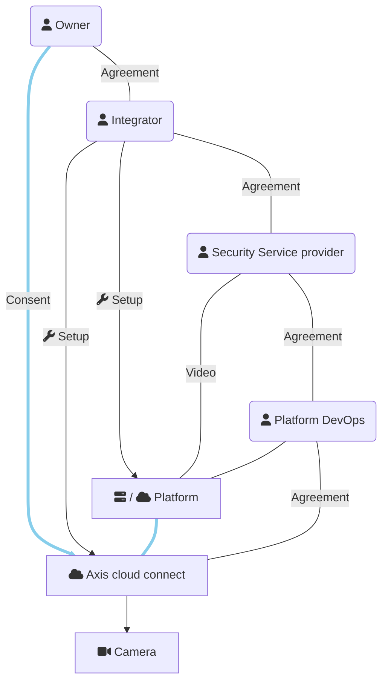

This is a minimal app showing how to handle consent on an Axis Cloud Connect
organisation when different parties are involved. It is the 'Platform' in the 
drawing below, initially abbreviated to P, hence the name.

Scope of this code
==================
This example demonstrates keeping track of consent. It is:

- Not an official demo from Axis Communications
- Not production ready
- Not self-contained

It depends on modules not shared with this code. Still, those modules
are non-essential for the core concept around OAuth2.

Roles
=====

| Role | Description |
| ---- | ----------- |
| Service Provider | Operates a service that requires device access, for example: live observation of cameras or automated collection of counting data. The Service Provider typically uses a software for this, which in this overview is called 'Platform' |
| Platform | The software that performs the actual interaction with cloud connected cameras. Can be a cloud application itself or an on-prem installation at the Service Provider |
| Platform DevOps | In case of a cloud Platform, the party that takes care of running it. Included in this list because we can assume this party has full access to the tokens stored in the Platform. |
| System Integrator | A party that installs devices and configures software system on behalf of the Enduser |
| Enduser/Owner | Owns the devices and provides consent on the Cloud Connect platform for use of the cameras by others |

This drawing shows the relations:

In real life parties can take up more than one role at the same time,
simplifying the diagram.

Short description of the flow
=============================
- Enduser and System Integrator agree on realisation of a certain service
- Enduser and/or System Integrator agree with Service Provider to actually
  provide the service
- Enduser invites System Integrator on the relevant Axis Cloud Connect
  organisations so that System Integrator can act on behalf of Enduser and has
  access to the Enduser organisation on mysystems.axis.com
- System integrator sets up the system, coordinating where necessary with Platform DevOps
  and Service Provider
- Service Provider commences delivery of the service, which is not possible
  due to lack of consent by Enduser
- Platform sends consent request by e-mail to Enduser
- Enduser provides consent by following link that lead to authentication
  process on Axis.com. Enduser selects the agreed organisation
- Service Provider can continue. He can use the devices inside the Platform
  but has _no_ access through mysystems.axis.com.

In reality, flows can deviate a bit. For example, when Integrator stays
involved he is likely to to provide consent on behalf of the Enduser.

A simple introduction to OAuth
==============================
Most of us are familiar with Google, Facebook and many others being able to
act as "identity provider" (abbreviated as IDP).  Many websites use this to
simply account management. This is convenient both for the website itself:
less account support, as well as for the user: less credentials to manage. You
will recognise this from the 'Login with Google', and others, option on
websites and apps.

The technology for this is called OAuth(2). Sometimes you'll see it mentioned
as OpenID Connect, which is a thin layer with functionality on top of OAuth2.
In OAuth terminology, websites as in the example above are called are called
'client' or 'app'.  OAuth can do more than efficient account management. It
supports granting clients access to data that is kept at the IDP. Let's take
Gmail as example, and some hypothetical web portal W that offers to help you
manage your e-mail.  You login at W using your Google account. You get
redirected to a dialog at google.com where you are notified that W wants full
access to your mailbox. This is called the consent screen. If you trust W with
your e-mail, and you trust Google to give access to W but not others, you
cross your fingers and confirm you consent that W may access your mailbox
until you revoke that access. Now, W can manage your mail for you.

OAuth and Axis Cloud Connect
----------------------------
Axis Cloud Connect also uses OAuth2 technology. The purpose is not simplified
account management but just to allow the owner of devices to provide consent
on specific clients accessing these devices. How it works is that an
application (here: P) registers as client with Axis Cloud Connect. This is a
one-time effort. It obtains a client ID and some secret value. To get access
to devices, it then assembles a url that needs to be passed to the owner of
the devices. This is done by e-mail in this demonstrator. The owner follows
the url to axis.com and provides consent on P accessing devices in a specific
'organisation'. A notification of this consent is sent by axis.com to P on a
callback URL that was provided during registration.  The details inside that
notification are stored by P so that it can access devices at a later time.

To keep this all safe and secure OAuth2 has some details which make the actual
mechanics a bit hard to grasp initially.  But the overall process and purpose
is as simple as explained above.

Acting on behalf of the enduser
-------------------------------
In professional video security, it is often the case that an Installer or
System Integrator (SI) takes care of system setup on behalf of an enduser.
When the software platform - P - is about to get involved, it is actually this
SI that grants access to P. For this to work, the owner must invite the SI as
administrator in his Axis Cloud Connect 'organisation'. This is done in the
'My systems' portal. From then on, the SI is able to consent to the use of
others using the devices, using _his_ MyAxis account and not the account of the
owner.

Implementation notes
====================
This module is built using Python and the [Django](https://www.djangoproject.com/) web framework.
It expects presence of other modules that in turn assume the presence of
[django-allauth](https://docs.allauth.org/en/latest/). django-allauth strongly
couples OAuth2 with website users and is less suitable to obtain
consent from 3rd party individuals. This module therefore uses
[Authlib](https://docs.authlib.org/en/latest/) but initialises Authlib using
the OAuth-client details provided by the configured client in django-allauth.

This aspect is not crucial and can be ignored. A convenient side effect is
that one need not setup a local enduser account on the demo instance. One can login
using Axis as identity provider. The device access that comes with this login
(one needs to provide consent on an organisation) is ignored by the system.

Multiple Service Providers
--------------------------
This demo assumes a single Service Provider.  Multiple Service providers would
be supported by multi-tenancy: Each service provider gets it's own domain name
and database and possibly independently running instance. The web framework on
which this demo runs supports that, however new tenants can not be managed
from inside the demo.

