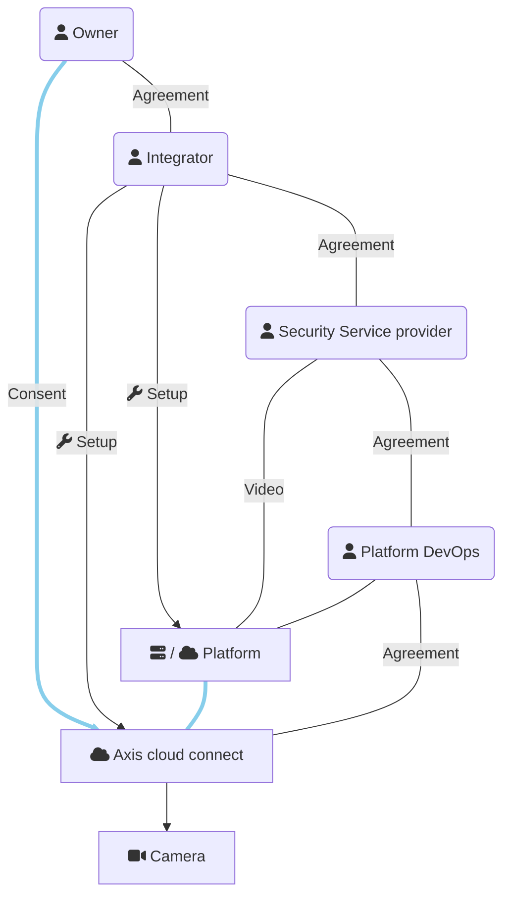

This is a minimal app showing how to handle consent on an Axis Cloud Connect
organisation when different parties are involved. It is the 'Platform' in the 
drawing below, initially abbreviated to P, hence the name.

Scope of this code
==================
This example demonstrates the use of the OAuth2 in context of Axis Cloud
Connect and does a suggestion for storage of the consent status. It is:

- Not an official demo from Axis Communications
- Not production ready
- Not self-contained

It depends on modules not shared with this code. Still, those modules
are non-essential for the core concept around OAuth2.

Roles
=====

| Role | Description |
| ---- | ----------- |
| Service Provider | Operates a service that requires device access, for example: live observation of cameras or automated collection of counting data |
| Platform | The software that performs the actual interaction with cloud connected cameras. Can be a cloud application itself or an on-prem installation at the Service Provider |
| Platform DevOps | In case of a cloud Platform, the party that takes care of running it. Included in this list because we can assume this party has full access to the tokens stored in the Platform. |
| System Integrator | A party that installs devices and configures software system on behalf of the Enduser |
| Enduser/Owner | Owns the devices and provides consent on the Cloud Connect platform for use of the cameras by others |

This drawing shows the relations:

In real life parties can take up more than one role at the same time,
simplifying the diagram.

Short description of the flow
=============================
- Enduser and System Integrator agree on realisation of a certain service
- Enduser and/or System Integrator agree with Service Provider to actually
  provide the service
- Enduser invites System Integrator on the relevant Axis Cloud Connect
  organisations so that System Integrator can act on behalf of Enduser and has
  access to the Enduser organisation on mysystems.axis.com
- System integrator sets up the system, coordinating where necessary with Platform DevOps
  and Service Provider
- Service Provider commences delivery of the service, which is not possible
  due to lack of consent by Enduser
- Platform sends consent request by e-mail to Enduser
- Enduser provides consent by following link that lead to authentication
  process on Axis.com. Enduser selects the agreed organisation
- Service Provider can continue. He can use the devices inside the Platform
  but has _no_ access through mysystems.axis.com.

In reality, flows can deviate a bit. For example, when Integrator stays
involved he is likely to to provide consent on behalf of the Enduser.

Multiple Service Providers
==========================
This demo assumes a single Service Provider.  Multiple Service providers would
be supported by multi-tenancy: Each service provider gets it's own domain name
and database and possibly independently running instance. The web framework on
which this demo runs supports that, however new tenants can not be managed
from inside the demo.

Implementation notes
====================
This module is built using Python and the [Django](https://www.djangoproject.com/) web framework.
It expects presence of other modules that in turn assume the presence of
[django-allauth](https://docs.allauth.org/en/latest/). django-allauth strongly
couples OAuth2 with website users and is less suitable to obtain
consent from 3rd party individuals. This module therefore uses
[Authlib](https://docs.authlib.org/en/latest/) but initialises Authlib using
the OAuth-client details provided by the configured client in django-allauth.

This aspect is not crucial and can be ignored. A convenient side effect is
that one need not setup a local enduser account on the demo instance. One can login
using Axis as identity provider. The device access that comes with this login
(one needs to provide consent on an organisation) is ignored by the system.
